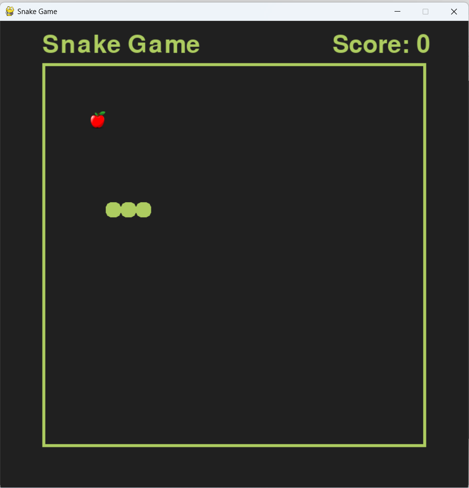

# A Simple Snake Game 

This is my first game with using pygame module in python 

There are some descriptions in code to change window properties or game speed 

## How it's look like: 

## The idea comes from a youtube video 

I got a lot of help from [Nick](https://www.youtube.com/@programmingwithnick)
